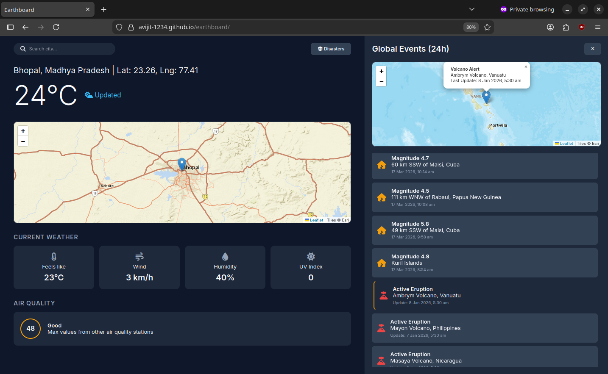

# Earthboard 🌍
**A real-time environmental intelligence dashboard tracking global geological events and local meteorological shifts.**

  

### 🔗 [Live Deployment](https://avijit-1234.github.io/earthboard/)

---

## 🛠 Tech Stack

| Technology | Purpose |
| :--- | :--- |
| **JavaScript (ES6+)** | Core logic, asynchronous data fetching, and DOM orchestration. |
| **Leaflet.js** | Interactive mapping engine for spatial data visualization. |
| **CSS3** | Custom dark-mode UI with Flexbox/Grid and transition-based state management. |
| **Open-Meteo API** | Source for hyper-local Weather, UV Index, and Air Quality (AQI) data. |
| **USGS API** | Real-time GeoJSON feed for global seismic activity (Earthquakes). |
| **NASA EONET** | Tracking engine for active volcanic eruptions and natural events. |
| **OSM Nominatim** | Reverse-geocoding to translate map coordinates into human-readable locations. |

---

## ⚖️ Data Sources & Attributions

This project is powered by open data and mapping services from the following providers:

  * **Maps & Imagery:** Tiles © [Esri](https://www.esri.com/) — Source: Esri, DeLorme, NAVTEQ, USGS, Intermap, iPC, NRCAN, Esri Japan, METI, Esri China (Hong Kong), Esri (Thailand), TomTom, 2012.
  * **Meteorological Data:** [Open-Meteo](https://open-meteo.com/) (Non-commercial use).
  * **Seismic Activity:** [USGS Earthquake Hazards Program](https://earthquake.usgs.gov/earthquakes/feed/).
  * **Volcanic Events:** [NASA EONET](https://eonet.gsfc.nasa.gov/) (Earth Observatory Natural Event Tracker).
  * **Geocoding Services:** [Nominatim](https://nominatim.org/) powered by [OpenStreetMap](https://www.openstreetmap.org/copyright/en) data.
  * **Mapping Library:** [Leaflet.js](https://leafletjs.com/) (BSD 2-Clause License).
  * **UI Icons:** [Font Awesome](https://fontawesome.com/) (CC BY 4.0).

---

## 🛰 System Architecture & Data Flow

Earthboard operates as a stateless, client-side application driven by asynchronous JavaScript. The data architecture is divided into two distinct engines that handle spatial interactions and real-time data ingestion independently.

### 1. Meteorological Engine (Weather & Air Quality)
This engine manages the primary interactive map and local climate data. It is triggered during the initial application load and subsequently by user interactions (searching or clicking).

* **Trigger 1: Map Click Interaction**
  * When the user clicks the Leaflet map, the engine captures the spatial coordinates (`LatLng`).
  * It first calls the **OSM Nominatim API** (Reverse Geocoding) to translate those raw coordinates into a human-readable city, state, or country string.
* **Trigger 2: Search Bar Input**
  * When the user types a location and hits 'Enter', the engine calls the **Open-Meteo Geocoding API**.
  * This API returns the exact latitude and longitude for the queried city, allowing the app to reposition the map camera and marker using Leaflet's `flyTo()` method.
* **Data Ingestion (The Core Loop):**
  * Once the coordinates are established (via click or search), the engine concurrently fires requests to the **Open-Meteo Forecast API** (for temperature, wind, humidity, and UV index) and the **Open-Meteo Air Quality API** (for the US AQI index).
  * **UI Synchronization:** Upon resolving the Promises, the engine updates the DOM elements in the main dashboard to reflect the hyper-local environmental conditions.

### 2. Geological Event Tracker (Disaster Panel)
This engine acts as a global monitoring system, aggregating and standardizing disparate data streams from government agencies. It runs automatically on initialization.

* **Concurrent & Fault-Tolerant Fetching:**
  * The system attempts to fetch data simultaneously from two distinct endpoints: the **USGS Earthquake API** (recent seismic activity) and the **NASA EONET API** (active volcanoes).
  * *Resiliency:* Because government servers (like NASA) can occasionally experience downtime (500 Internal Server Errors), the engine isolates each fetch request within its own `try/catch` block. If one API fails, the other will still successfully load and render its data.
* **Data Normalization:**
  * USGS returns data in a standard `GeoJSON` format, while NASA EONET uses a proprietary nested JSON structure. 
  * The engine intercepts both responses, extracts the relevant fields, and normalizes them into a unified, flat JavaScript array containing standardized keys: `type`, `time`, `lat`, `lng`, `title`, and `desc`.
* **Chronological Sorting & Rendering:**
  * The newly unified array is sorted chronologically based on UNIX timestamps to ensure the absolute most recent global events appear at the top of the feed.
  * **UI Synchronization:** The engine iterates through the sorted array to inject HTML event cards into the sidebar and plot corresponding interactive markers on the secondary Leaflet disaster map. Clicking a sidebar card triggers a spatial map animation to focus on that specific event's coordinates.
